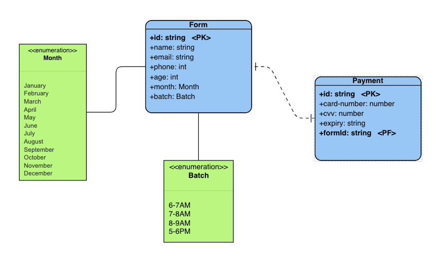

# Yoga-Form
A form to enroll for yoga classes.

## Tech Stack
- React
- Node.js
- Express.js
- MongoDB
- HTML
- CSS

## Features
- Accepst the user data, does basic validation 
- Stores the data in database
- Payment 
- See the enrolled users

## Requirements Fulfilled
- Only people within the age limit of 18-65 can enroll for the classes.
- They will be paying the fees on a monthly basis.
- They can enroll any day but they will have to pay for the entire month. The monthly fee is 500/- Rs INR.
- There are 4 batches a day namely 6-7AM, 7-8AM, 8-9AM and 5-6PM. The participants can choose any batch in a month and can move to any other batch next month but in the same month they need to be in same batch.
- If a user has enrolled for a batch in a month. Then he/she cannot enroll again in the same month.

## Assumptions
- Every user will have their unique Email ID.
- A mock function named CompletePayment() which accepts the details of user and payment and does the payment for you.

## Database
MongoDB has been used. The database has one collection named "forms" which contains the data filled in the form. It has the following attributes - id, name, email, phone, age, month, and batch. 

### ER Diagram
